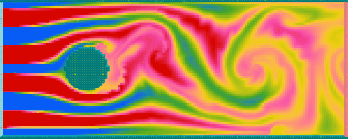
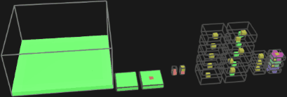
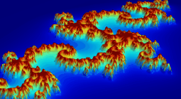
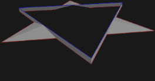
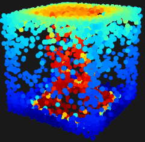
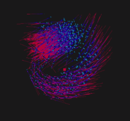
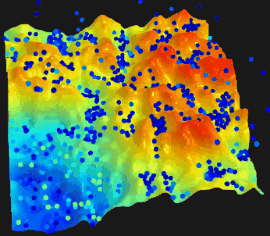

# Sandbox
Sandbox environment with various personal projects and experimentations implemented from scratch (physics simulations, fractals, swarm intelligence, precedural generation, computational geometry, curved space-time rendering, ...). All projects use the same generic UI with interactive plots, automated parameter handling and 3D display scene. The repo is standalone and does not rely on any external library.

\

\

\

## Code structure

**main.cpp** contains the main program loop, parameter list display, mouse/keyboard interactions, creation/destruction of the active project

**Data.hpp** contains the parameter list and plot data shared between the UI and each project

**Projects/** contains all projects currently implemented in the sandbox environment. All projects share the same structure with initialization of their parameter list, status flags, refresh/animate/draw methods

**util/** contains header-only utility namespaces for colormaps, random numbers, vectors, fields, ...

**tb/** contains arcball operators and tools for camera handling in the 3D scene

**FileIO/** contains functions for file read/write

**Resources/** contains various files to be used by projects

## Minimal build env on windows
Get Win64 gcc compiler and extract at root of C: drive or another appropriate location
https://github.com/brechtsanders/winlibs_mingw/releases/download/12.2.0-14.0.6-10.0.0-ucrt-r2/winlibs-x86_64-posix-seh-gcc-12.2.0-mingw-w64ucrt-10.0.0-r2.7z
Doc available at  https://winlibs.com/

Install MinGW at root of C: drive or another appropriate location
https://sourceforge.net/projects/mingw/
Only check "msys-base" package in MinGW Installation Manager to get bash commands in bin folder

Add to path env var (here shown in the case of C: drive root)
- C:\mingw64\bin
- C:\MinGW\msys\1.0\bin

## Build, run and use
- make clean (optional)
- make depend (optional)
- make
- ./main
- *press alphabet key to activate the associated project, no documentation, see project_SetActiveProject()*
- *use mouse clics to rotate, pan and zoom with the arcball to move in the 3D scene*
- *use KB arrows, modifier keys, or mouse wheel to change parameter values in the active project, see callback_keyboard_special() and callback_mouse_click()*
- *use spacebar to run animation/simulation if the active project supports it*
- *use number keys to toggle various displays in the active project*

